# Results from simulations

## What we are trying to reproduce

I think we could aim to reproduce the following from the experiment:

### Accumulation of Ase1

The timescale of accumulation of additional molecules of Ase1, and the amount accumulated at steady state. From the experiments (dots are binned data, line is a fit):

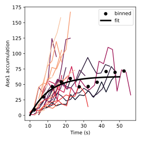

We can fit this data to:

$A_{end} (1 - exp(-t / \tau_{A}))$

Where $A_{end}$ is the accumulation at the end, $\tau_A$ the timescale of the accumulation. The values that come out are:

* $\tau_A$: 10.82 s
* $A_{end}$: 4.84 molecules of Ase1 (per protofilament)

We could do the same thing for the normalised data.

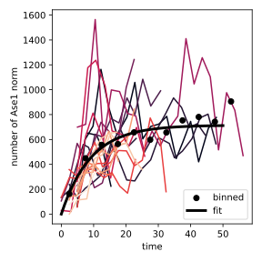

If so, the parameters:

* $\tau_A$: 9.06 s
* $A_{end}$: 714 (a normalised value)

### Shrinking speed

The shrinking speed at steady state (at the end), and the timescale of the decrease in shrinking speed.

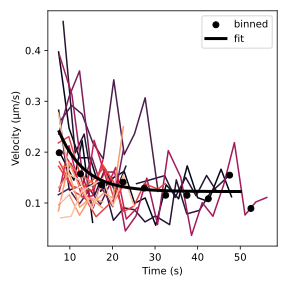

We can fit this data to:

$ v_0 (1 - exp(-t / \tau_{v}) + v_{end}$

Where $v_{end}$ is the accumulation at the end, $\tau_v$ the timescale of the decrease in shrinking speed. The values from the fit:

* $v_{end}$ = 123 nm/s
* $\tau_v$ = 5.95 s

## Experimentally constrained parameters

From the paper.

* Velocity without ase1: 300 nm/s
* $k_{off}$ unbinding rate of Ase1: 0.016 s (from FRAP)
* $k_{on}$ binding rate of Ase1: 0.001 (for the density in the body of the microtubule to match the experiment)
* Diffusion rate of Ase1: 0.09 $\mu m^2/s$ (From your experiment)

With these constrains, the only free parameter is omega.

# Model without cooperativity

The model without modifications. In the figures below each dot is the result of a simulation, and the horizontal line is the value expected from experimental data. To be honest, I think for a value of around 0.85 the agreement is quite good, considering that this is a one parameter, one filament model.

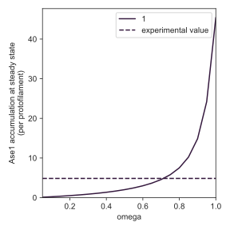
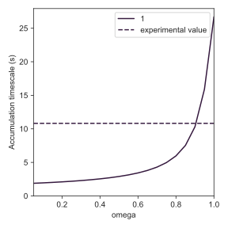
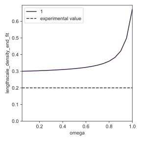
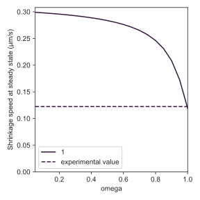

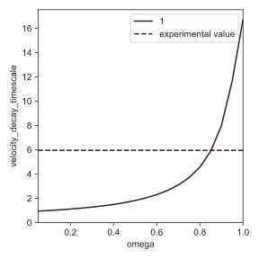

### Estimating best fit

To estimate the best fit, for each pair of the experimental (E) and simulation (S) values, I calculate a goodness of fit:
$$ \frac{(E-S)}{E}^2$$

Then, to i either do the arithmetic or geometric mean of all the coefficients, results below.

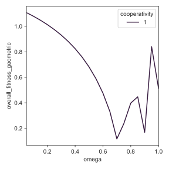

## Model without cooperativity - closer look

Here we focus on omega from 0.7 to 1

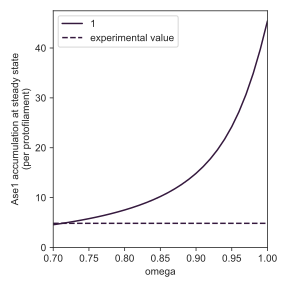
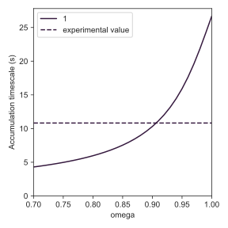
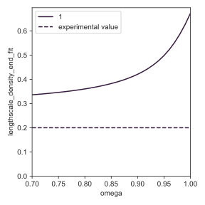
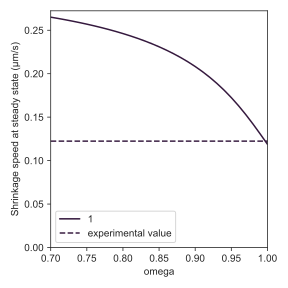

### Estimating best fit

Here you can see that the value of 0.87 or so gives the best score for geometrical mean.

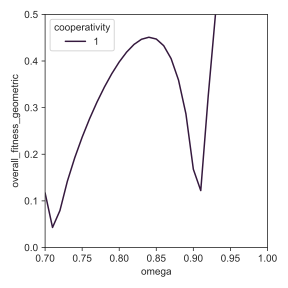

## Adding cooperativity

The problem with the simple model is indeed that the effect on the speed is too small for the amount of accumulated Ase1. So we can say that more binding sites are involved